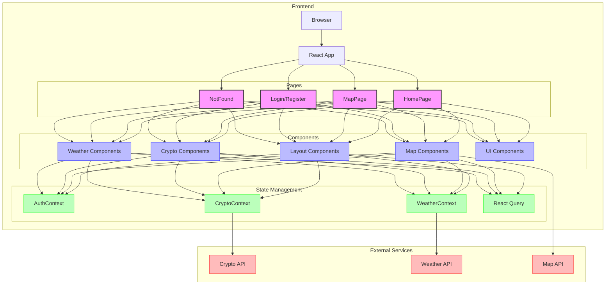
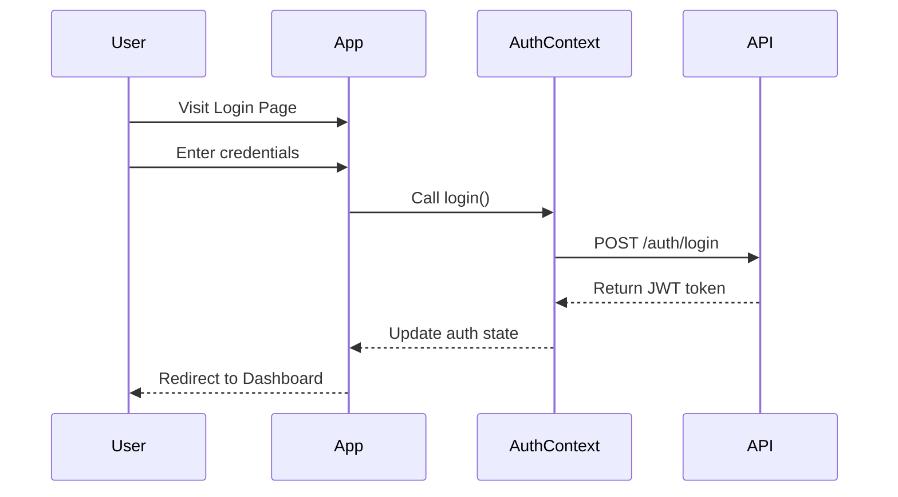

# System Architecture Diagram

## Component Overview

### Pages
- **HomePage**: Landing page with hero, features, and testimonials sections
- **MapPage**: Interactive map displaying crypto-friendly locations
- **Login/Register**: User authentication pages
- **NotFound**: 404 error page

### Key Components
- **Layout Components**: Main layout, navigation bar, and footer
- **Map Components**: Interactive map, filters, and location details sidebar
- **Crypto Components**: Exchange rate displays and cryptocurrency cards
- **Weather Components**: Weather indicators for travel locations
- **UI Components**: Base reusable UI components from shadcn/ui

### State Management
- **AuthContext**: User authentication state
- **CryptoContext**: Cryptocurrency data and rates
- **WeatherContext**: Weather information based on location
- **React Query**: External API data fetching and caching

### External Services
- **Crypto API**: Price and exchange rate data
- **Weather API**: Weather data by location
- **Map API**: Map rendering and location data

## Data Flow

1. User interacts with the application through pages
2. Components render UI and handle user interactions
3. Context providers manage application state
4. React Query handles API data fetching, caching, and refreshing
5. External services provide real-time data

## Authentication Flow

## Feature Extension Points

When adding new features, consider these extension points:

1. **New Page**: Add a new page in the pages directory
2. **New Component**: Create in the appropriate component subfolder
3. **New API Service**: Add to the lib/api directory
4. **New Context**: Create in the contexts directory if needed for global state
